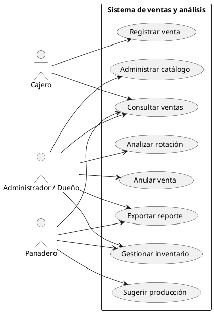

## 7. Diagrama de casos de uso (PlantUML)

```plantuml
@startuml
left to right direction
actor Cajero
actor "Administrador / Dueño" as Admin
actor Panadero
rectangle "Sistema de ventas y análisis" {
 usecase "Registrar venta" as CU1
 usecase "Administrar catálogo" as CU2
 usecase "Consultar ventas" as CU3
 usecase "Sugerir producción" as CU4
 usecase "Analizar rotación" as CU5
 usecase "Gestionar inventario" as CU6
 usecase "Anular venta" as CU7
 usecase "Exportar reporte" as CU8
}
Cajero --> CU1
Cajero --> CU3
Admin --> CU2
Admin --> CU3
Admin --> CU5
Admin --> CU6
Admin --> CU7
Admin --> CU8
Panadero --> CU3
Panadero --> CU4
Panadero --> CU6
Panadero --> CU8
@enduml
```
