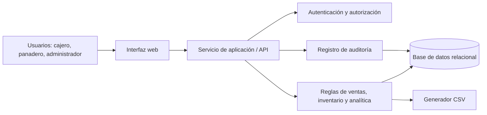

## 5. Arquitectura lógica propuesta

```mermaid
flowchart LR
  U[Usuarios: cajero, panadero, administrador] --> UI[Interfaz web]
  UI --> API[Servicio de aplicación / API]
  API --> AUTH[Autenticación y autorización]
  API --> DOM[Reglas de ventas, inventario y analítica]
  DOM --> DB[(Base de datos relacional)]
  DOM --> CSV[Generador CSV]
  API --> AUD[Registro de auditoría]
  AUD --> DB
```

La arquitectura es una recomendación coherente con el alcance; no afirma que el código actual ya use estas tecnologías.
